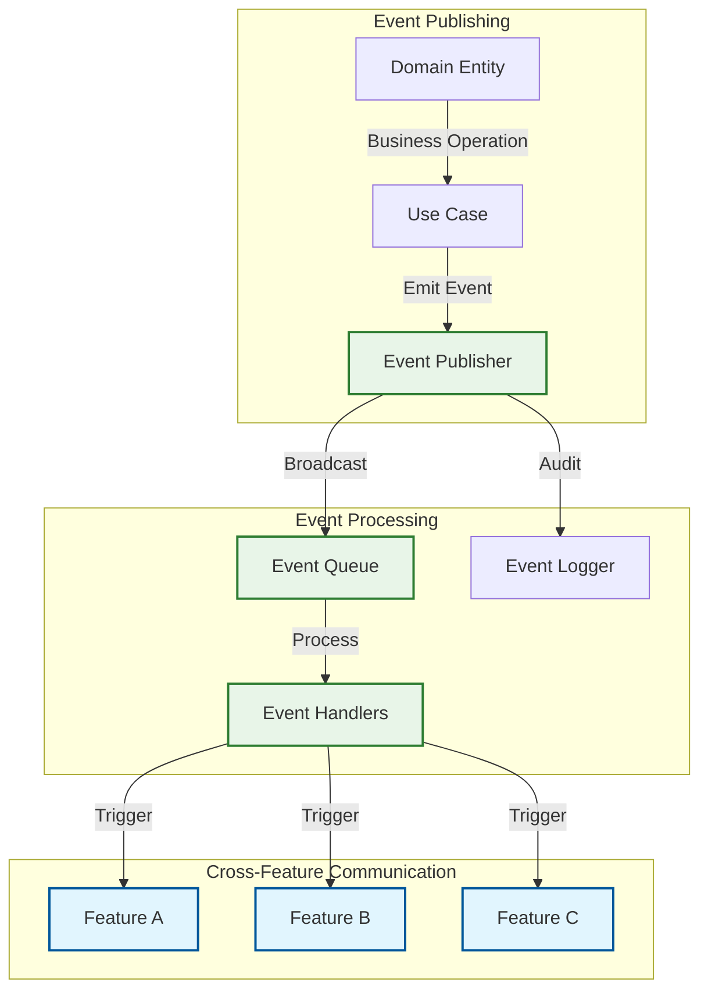
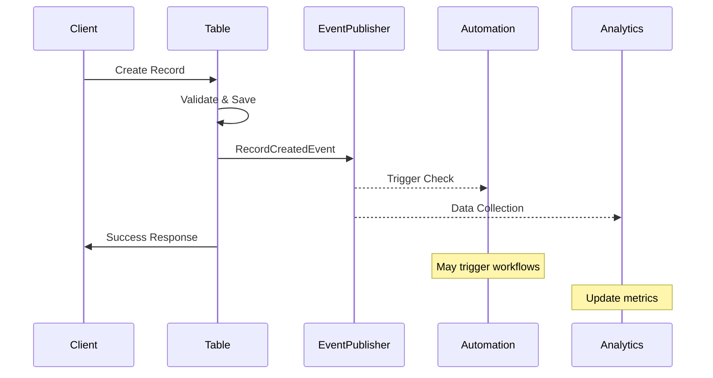
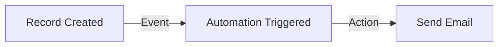
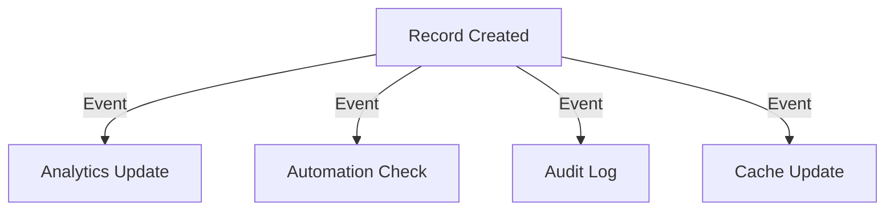
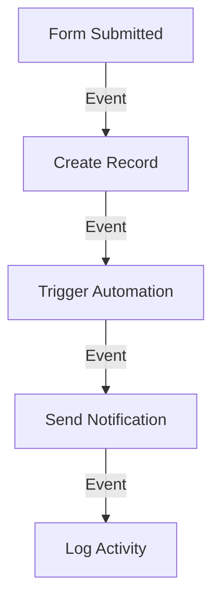
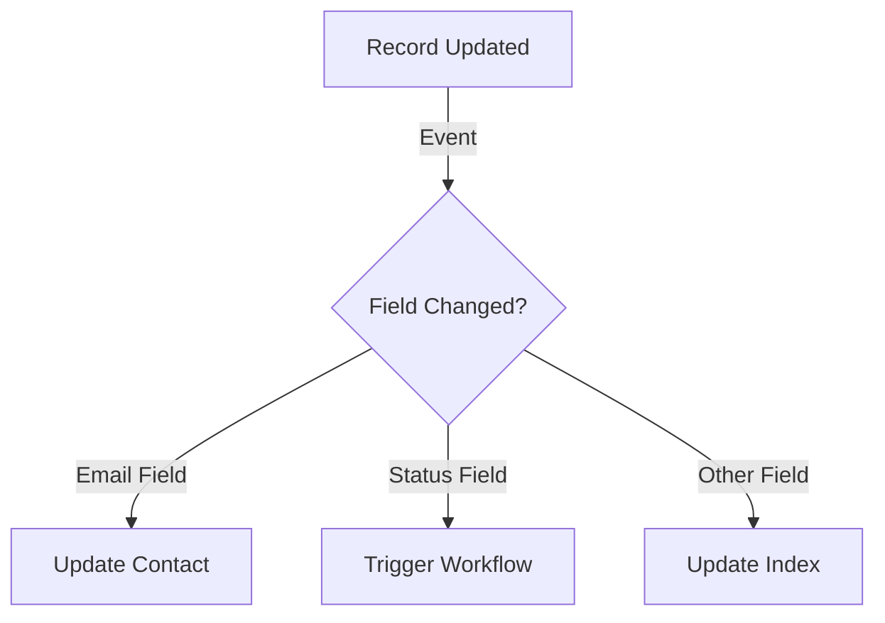

# Domain Events and Event Flow

This document describes the domain events system and how events flow through the LaTeChforce Engine to enable loose coupling between features.

## Event System Architecture

### Core Components



## Event Types and Flows

### 1. Table Events

#### RecordCreatedEvent
**Trigger**: When a new record is created in any table
**Publishers**: `CreateRecordUseCase`, `CreateMultipleRecordsUseCase`
**Consumers**: Automation triggers, audit logging, analytics

```typescript
interface RecordCreatedEvent {
  aggregateType: 'table'
  eventType: 'record-created'
  aggregateId: string
  payload: {
    tableId: string
    recordId: string
    fields: Record<string, unknown>
  }
  occurredOn: Date
}
```

**Flow Diagram**:


#### RecordUpdatedEvent
**Trigger**: When an existing record is modified
**Publishers**: `UpdateRecordUseCase`, `UpdateMultipleRecordsUseCase`
**Consumers**: Change tracking, automation triggers, cache invalidation

```typescript
interface RecordUpdatedEvent {
  aggregateType: 'table'
  eventType: 'record-updated'
  aggregateId: string
  payload: {
    tableId: string
    recordId: string
    previousFields: Record<string, unknown>
    currentFields: Record<string, unknown>
    changedFields: string[]
  }
  occurredOn: Date
}
```

#### RecordDeletedEvent
**Trigger**: When a record is deleted
**Publishers**: `DeleteRecordUseCase`, `DeleteMultipleRecordsUseCase`
**Consumers**: Cleanup automations, audit trails, cascade operations

```typescript
interface RecordDeletedEvent {
  aggregateType: 'table'
  eventType: 'record-deleted'
  aggregateId: string
  payload: {
    tableId: string
    recordId: string
    deletedFields: Record<string, unknown>
  }
  occurredOn: Date
}
```

### 2. Automation Events

#### AutomationTriggeredEvent
**Trigger**: When an automation is triggered by an external event
**Publishers**: Trigger evaluation system
**Consumers**: Action executors, run trackers, monitoring

```typescript
interface AutomationTriggeredEvent {
  aggregateType: 'automation'
  eventType: 'automation-triggered'
  aggregateId: string
  payload: {
    automationId: string
    triggerId: string
    triggerData: Record<string, unknown>
    runId: string
  }
  occurredOn: Date
}
```

#### ActionExecutedEvent
**Trigger**: When an individual action completes
**Publishers**: Action execution system
**Consumers**: Next action in sequence, error handlers, monitoring

```typescript
interface ActionExecutedEvent {
  aggregateType: 'automation'
  eventType: 'action-executed'
  aggregateId: string
  payload: {
    automationId: string
    actionId: string
    runId: string
    result: 'success' | 'failure'
    data?: Record<string, unknown>
    error?: string
  }
  occurredOn: Date
}
```

### 3. Connection Events

#### ConnectionEstablishedEvent
**Trigger**: When a new external service connection is created
**Publishers**: `AuthenticateConnectionUseCase`
**Consumers**: Integration health monitoring, usage tracking

```typescript
interface ConnectionEstablishedEvent {
  aggregateType: 'connection'
  eventType: 'connection-established'
  aggregateId: string
  payload: {
    connectionId: string
    service: string
    userId: string
  }
  occurredOn: Date
}
```

### 4. Form Events

#### FormSubmittedEvent
**Trigger**: When a form is successfully submitted
**Publishers**: Form submission handlers
**Consumers**: Table record creation, automation triggers, notifications

```typescript
interface FormSubmittedEvent {
  aggregateType: 'form'
  eventType: 'form-submitted'
  aggregateId: string
  payload: {
    formId: string
    submissionId: string
    data: Record<string, unknown>
    submittedBy?: string
  }
  occurredOn: Date
}
```

## Event Flow Patterns

### 1. Simple Event Flow
One event triggers one action in another feature:



### 2. Fan-out Event Flow
One event triggers multiple independent actions:



### 3. Chain Event Flow
Events trigger a sequence of operations:



### 4. Conditional Event Flow
Events trigger different actions based on conditions:



## Event Handler Implementation

### Event Handler Pattern

```typescript
// Event handler interface
interface IDomainEventHandler<T extends DomainEvent> {
  handle(event: T): Promise<void>
  canHandle(event: DomainEvent): boolean
}

// Example handler implementation
export class RecordCreatedHandler implements IDomainEventHandler<RecordCreatedEvent> {
  constructor(
    private readonly automationService: IAutomationService,
    private readonly logger: LoggerService
  ) {}

  canHandle(event: DomainEvent): boolean {
    return event.eventType === 'record-created'
  }

  async handle(event: RecordCreatedEvent): Promise<void> {
    this.logger.info(`Processing record created event for record ${event.payload.recordId}`)
    
    // Check for automations triggered by this event
    await this.automationService.evaluateTriggersForEvent(event)
  }
}
```

### Handler Registration

```typescript
// In the feature factory
export function registerEventHandlers(
  eventPublisher: IDomainEventPublisher,
  container: SimpleContainer
) {
  const automationService = container.get('automationService')
  const logger = container.get('logger')
  
  // Register handlers
  eventPublisher.registerHandler(
    new RecordCreatedHandler(automationService, logger)
  )
  
  eventPublisher.registerHandler(
    new FormSubmittedHandler(tableService, logger)
  )
}
```

## Event Processing Patterns

### 1. Synchronous Processing
Events are processed immediately in the same transaction:

```typescript
export class CreateRecordUseCase {
  async execute(input: CreateRecordInput): Promise<Record> {
    // Create record
    const record = await this.recordRepository.save(newRecord)
    
    // Emit event synchronously
    await this.eventPublisher.publish(
      new RecordCreatedEvent(record.tableId, {
        tableId: record.tableId,
        recordId: record.id,
        fields: record.fields
      })
    )
    
    return record
  }
}
```

### 2. Asynchronous Processing
Events are queued for later processing:

```typescript
export class CreateRecordUseCase {
  async execute(input: CreateRecordInput): Promise<Record> {
    // Create record
    const record = await this.recordRepository.save(newRecord)
    
    // Queue event for async processing
    await this.eventQueue.enqueue(
      new RecordCreatedEvent(record.tableId, {
        tableId: record.tableId,
        recordId: record.id,
        fields: record.fields
      })
    )
    
    return record
  }
}
```

### 3. Batch Processing
Multiple events are processed together:

```typescript
export class BatchEventProcessor {
  async processBatch(events: DomainEvent[]): Promise<void> {
    // Group events by type
    const eventGroups = this.groupEventsByType(events)
    
    // Process each group
    for (const [eventType, groupedEvents] of eventGroups) {
      await this.processEventGroup(eventType, groupedEvents)
    }
  }
}
```

## Error Handling and Resilience

### 1. Retry Mechanisms

```typescript
export class ResilientEventHandler {
  async handle(event: DomainEvent): Promise<void> {
    const maxRetries = 3
    let attempt = 0
    
    while (attempt < maxRetries) {
      try {
        await this.processEvent(event)
        return // Success
      } catch (error) {
        attempt++
        if (attempt >= maxRetries) {
          await this.handleFailedEvent(event, error)
          throw error
        }
        await this.delay(Math.pow(2, attempt) * 1000) // Exponential backoff
      }
    }
  }
}
```

### 2. Dead Letter Queue

```typescript
export class EventProcessor {
  async processEvent(event: DomainEvent): Promise<void> {
    try {
      await this.handleEvent(event)
    } catch (error) {
      if (this.isRecoverableError(error)) {
        await this.requeueEvent(event)
      } else {
        await this.sendToDeadLetterQueue(event, error)
      }
    }
  }
}
```

### 3. Circuit Breaker

```typescript
export class CircuitBreakerEventHandler {
  private circuitBreaker = new CircuitBreaker()
  
  async handle(event: DomainEvent): Promise<void> {
    if (this.circuitBreaker.isOpen()) {
      await this.handleEventOffline(event)
      return
    }
    
    try {
      await this.processEvent(event)
      this.circuitBreaker.recordSuccess()
    } catch (error) {
      this.circuitBreaker.recordFailure()
      throw error
    }
  }
}
```

## Event Monitoring and Debugging

### 1. Event Logging

```typescript
export class EventLogger {
  async logEvent(event: DomainEvent): Promise<void> {
    const logEntry = {
      eventId: generateId(),
      eventType: event.eventType,
      aggregateType: event.aggregateType,
      aggregateId: event.aggregateId,
      payload: event.payload,
      timestamp: event.occurredOn,
      processingStatus: 'received'
    }
    
    await this.eventLogRepository.save(logEntry)
  }
}
```

### 2. Event Metrics

```typescript
export class EventMetrics {
  async recordEventProcessed(event: DomainEvent, duration: number): Promise<void> {
    await this.metricsService.increment('events.processed', {
      eventType: event.eventType,
      aggregateType: event.aggregateType
    })
    
    await this.metricsService.histogram('events.processing_duration', duration, {
      eventType: event.eventType
    })
  }
}
```

### 3. Event Tracing

```typescript
export class EventTracer {
  async traceEvent(event: DomainEvent, operation: string): Promise<void> {
    const trace = {
      eventId: event.eventId,
      operation,
      timestamp: new Date(),
      metadata: {
        aggregateType: event.aggregateType,
        eventType: event.eventType
      }
    }
    
    await this.tracingService.recordTrace(trace)
  }
}
```

## Best Practices

### 1. Event Design
- **Immutable**: Events should never change once created
- **Self-contained**: Include all necessary data in the event payload
- **Versioned**: Consider event schema evolution
- **Meaningful names**: Use clear, domain-specific event names

### 2. Handler Design
- **Idempotent**: Handlers should be safe to run multiple times
- **Fast**: Keep handlers lightweight and fast
- **Isolated**: Handlers should not depend on each other
- **Error-safe**: Handle failures gracefully

### 3. Performance Considerations
- **Async processing**: Use async processing for non-critical events
- **Batching**: Group related events for efficiency
- **Filtering**: Only process events that matter to your feature
- **Monitoring**: Track event processing performance

### 4. Testing Events
- **Unit tests**: Test event creation and handler logic
- **Integration tests**: Test event flow between features
- **Contract tests**: Verify event schema compatibility
- **Performance tests**: Ensure event processing scales

## Migration and Versioning

### Event Schema Evolution

```typescript
// Version 1
interface RecordCreatedEventV1 {
  tableId: string
  recordId: string
  fields: Record<string, unknown>
}

// Version 2 - Added user context
interface RecordCreatedEventV2 {
  tableId: string
  recordId: string
  fields: Record<string, unknown>
  createdBy: string
  version: 2
}

// Handler that supports both versions
export class VersionedRecordCreatedHandler {
  async handle(event: RecordCreatedEvent): Promise<void> {
    const version = event.payload.version || 1
    
    switch (version) {
      case 1:
        await this.handleV1(event.payload as RecordCreatedEventV1)
        break
      case 2:
        await this.handleV2(event.payload as RecordCreatedEventV2)
        break
      default:
        throw new Error(`Unsupported event version: ${version}`)
    }
  }
}
```

---

*This event flow documentation provides the complete picture of how domain events enable loose coupling and communication between features in the LaTeChforce Engine.*