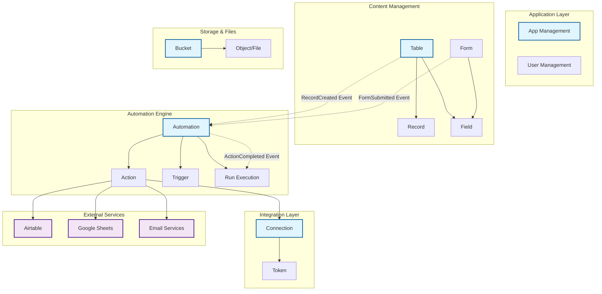
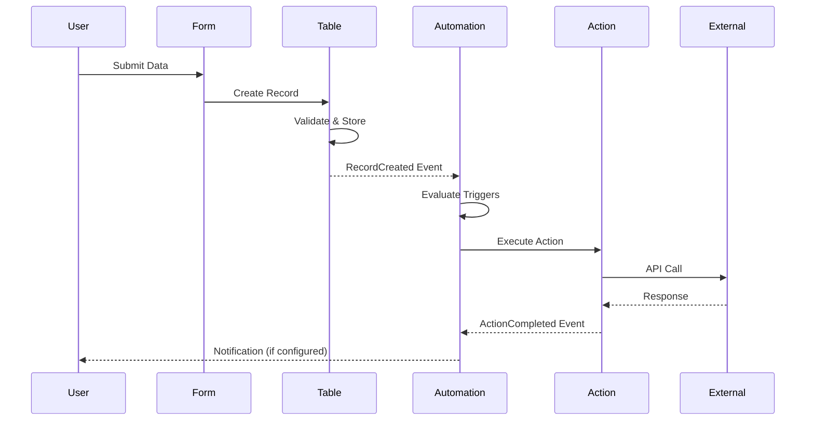

# Feature Boundaries and Domain Map

This document provides a visual overview of the feature boundaries and their relationships within the LaTeChforce Engine.

## Domain Overview



## Aggregate Boundaries

### 1. Table Aggregate
**Aggregate Root**: Table  
**Bounded Context**: Content Management

```
┌─ Table Aggregate ─────────────────────┐
│                                       │
│  ┌─────────┐     ┌─────────────────┐ │
│  │  Table  │────▶│     Record      │ │
│  │  (Root) │     │                 │ │
│  └─────────┘     └─────────────────┘ │
│       │                              │
│       ▼                              │
│  ┌─────────┐                        │
│  │  Field  │                        │
│  └─────────┘                        │
│                                       │
│  Events: RecordCreated,               │
│          RecordUpdated,               │
│          RecordDeleted                │
└───────────────────────────────────────┘
```

**Responsibilities**:
- Data schema definition
- Record CRUD operations
- Field validation and constraints
- Data integrity enforcement

### 2. Automation Aggregate
**Aggregate Root**: Automation  
**Bounded Context**: Workflow Orchestration

```
┌─ Automation Aggregate ────────────────┐
│                                       │
│  ┌──────────────┐  ┌─────────────────┐│
│  │  Automation  │──│     Action      ││
│  │    (Root)    │  │                 ││
│  └──────────────┘  └─────────────────┘│
│       │                              │
│       ▼                              │
│  ┌─────────────────┐                 │
│  │     Trigger     │                 │
│  └─────────────────┘                 │
│                                       │
│  Events: AutomationTriggered,         │
│          ActionExecuted,              │
│          AutomationCompleted          │
└───────────────────────────────────────┘
```

**Responsibilities**:
- Workflow definition and execution
- Trigger condition evaluation
- Action orchestration
- Execution state management

### 3. Connection Aggregate
**Aggregate Root**: Connection  
**Bounded Context**: External Integration

```
┌─ Connection Aggregate ────────────────┐
│                                       │
│  ┌─────────────┐   ┌─────────────────┐│
│  │ Connection  │──▶│     Token       ││
│  │   (Root)    │   │                 ││
│  └─────────────┘   └─────────────────┘│
│                                       │
│  Events: ConnectionEstablished,       │
│          TokenRefreshed,              │
│          ConnectionDisconnected       │
└───────────────────────────────────────┘
```

**Responsibilities**:
- OAuth flow management
- Token lifecycle management
- Connection status tracking
- Authentication and authorization

### 4. Bucket Aggregate
**Aggregate Root**: Bucket  
**Bounded Context**: File Storage

```
┌─ Bucket Aggregate ────────────────────┐
│                                       │
│  ┌─────────────┐   ┌─────────────────┐│
│  │   Bucket    │──▶│     Object      ││
│  │   (Root)    │   │    (File)       ││
│  └─────────────┘   └─────────────────┘│
│                                       │
│  Events: FileUploaded,                │
│          FileDeleted,                 │
│          BucketCreated                │
└───────────────────────────────────────┘
```

**Responsibilities**:
- File storage management
- Object metadata tracking
- Access control and permissions
- Storage quota management

### 5. Application Aggregate
**Aggregate Root**: App  
**Bounded Context**: Application Management

```
┌─ Application Aggregate ───────────────┐
│                                       │
│  ┌─────────────┐   ┌─────────────────┐│
│  │     App     │──▶│     Form        ││
│  │   (Root)    │   │                 ││
│  └─────────────┘   └─────────────────┘│
│       │                              │
│       ▼                              │
│  ┌─────────────────┐                 │
│  │      User       │                 │
│  └─────────────────┘                 │
│                                       │
│  Events: AppDeployed,                 │
│          UserAuthenticated,           │
│          FormSubmitted                │
└───────────────────────────────────────┘
```

**Responsibilities**:
- Application configuration
- User authentication and authorization
- Form definition and processing
- Application lifecycle management

## Event Flow Diagram



## Integration Patterns

### 1. Event-Driven Communication
Features communicate through domain events to maintain loose coupling:

```
┌─────────┐    RecordCreated     ┌─────────────┐
│  Table  │────────────────────▶│ Automation  │
└─────────┘                     └─────────────┘

┌─────────┐   FormSubmitted     ┌─────────────┐
│  Form   │────────────────────▶│ Automation  │
└─────────┘                     └─────────────┘
```

### 2. Anti-Corruption Layers
External services are protected by anti-corruption layers:

```
┌─────────────┐    ACL    ┌──────────────┐
│   Domain    │◄─────────▶│   External   │
│   Objects   │           │   Service    │
└─────────────┘           └──────────────┘
```

### 3. Shared Kernel
Common value objects are shared across features:

```
┌─────────────────────────────────────┐
│           Shared Kernel             │
│  ┌────┐ ┌──────┐ ┌───────┐ ┌─────┐ │
│  │ Id │ │ Name │ │ Email │ │ Url │ │
│  └────┘ └──────┘ └───────┘ └─────┘ │
└─────────────────────────────────────┘
          ▲         ▲         ▲
    ┌─────┴──┐ ┌────┴────┐ ┌──┴─────┐
    │ Table  │ │   App   │ │ Bucket │
    └────────┘ └─────────┘ └────────┘
```

## Boundary Rules

### Domain Layer Rules
1. **No Cross-Feature Imports**: Domain entities cannot import from other features
2. **No Infrastructure Dependencies**: Domain must remain pure
3. **Event-Only Communication**: Use domain events for cross-feature communication

### Application Layer Rules
1. **Use Case Isolation**: Each use case should be focused on a single operation
2. **DTO Transformation**: Transform between domain objects and DTOs
3. **Event Publishing**: Emit domain events for significant operations

### Infrastructure Layer Rules
1. **Repository Implementation**: Implement domain repository interfaces
2. **Anti-Corruption Layers**: Use ACLs for external service integration
3. **Database Abstraction**: Hide database implementation details

## Migration Guidelines

When adding new features or modifying existing ones:

1. **Check Aggregate Boundaries**: Ensure the change fits within existing boundaries
2. **Define Events**: Create appropriate domain events for communication
3. **Update Documentation**: Reflect changes in this diagram
4. **Architecture Tests**: Ensure tests pass with new boundaries
5. **Review Integration Points**: Verify external service interactions

## Tools and Automation

### Code Generation
```bash
# Generate new feature with proper boundaries
bun run generate:feature newfeature --full
```

### Architecture Testing
```bash
# Verify boundary compliance
bun test test/architecture/architecture-rules.test.ts
```

### Boundary Visualization
This document serves as the living documentation of feature boundaries. Update it whenever:
- New features are added
- Existing features are modified
- Aggregate boundaries change
- Integration patterns evolve

---

*Last updated: Phase 4 Implementation (December 2024)*
*Next review: When new features are added or boundaries change*